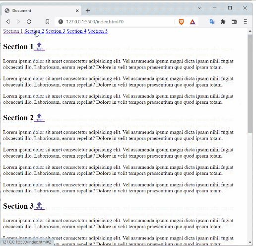
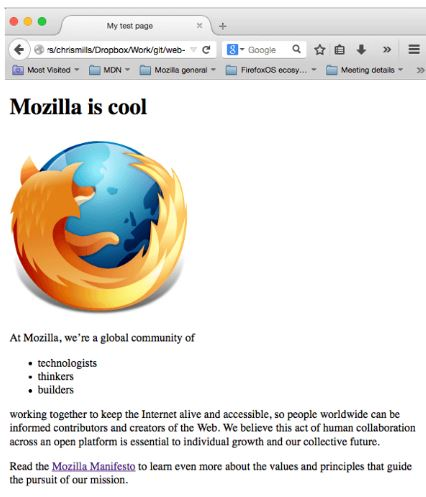
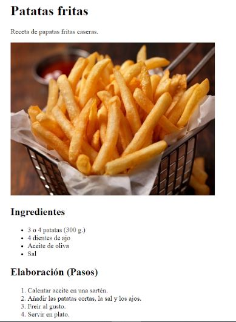
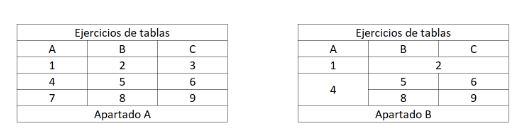
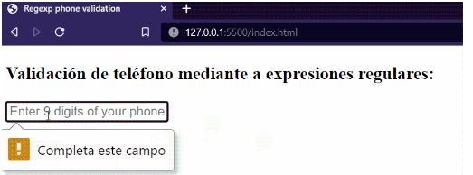
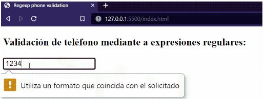
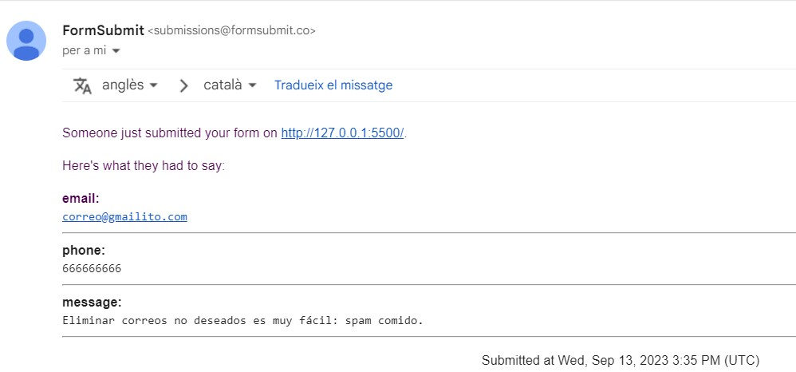

# Ejercicio 1: Anclas
1. Crear un repositorio GitHub
3. Crea las diferentes secciones de un HTML (header, main, footer...).
4. Utilizar NAV para escribir los enlaces del menú principal
5. Haz un menú de anclas que baje hasta cada title (utiliza ids para ello)
6. Finalmente haz que encabezado (titulo) vaya acompañado de un 🔝 que nos desplace arriba del todo de nuestra web  

# Ejercicio 2: Mozilla
Clona la siguiente página web intentado que se parezca lo máximo posible:  

# Ejercicio 3: Patatas fritas
Clona la siguiente página web intentado que se parezca lo máximo posible:  

# Ejercicio 4: Tablas
Clona la siguiente página web intentado que se parezca lo máximo posible:  
  
Para que las tablas tengan bordes añadiremos el siguiente CSS:  

&#60;style&#62;
      table, tr, td{
            border: solid 1px black;
    }
&#60;/&#62;

# Ejercicio 5: Regexp
Realiza un formulario que contenga un input que realice la validación de si tenemos un número de teléfono con 9 dígitos. En caso de no ser de 9 dígitos, deberá de aparecer un error y no poder realizar el envío del formulario. Para ayudar al usuario haz que aparezca un placeholder indicando que el número de teléfono deberá de tener 9 dígitos.  
  
Para resolver el regexp puedes apoyarte del siguiente tutorial: https://stackoverflow.com/questions/71956383/how-i-use-regex-pattern-in-html-text-input-to-validate-phone-number

# Ejercicio 6: Envío de datos mediante a un formulario
Regístrate en la web https://formsubmit.co/ y crea un formulario que envíe a la ruta correspondiente a tu correo un correo, un teléfono y un mensaje.

Adjunta una captura que verifique que has recibido los datos en un correo (si no te llegan, mira en la bandeja de spam):  

